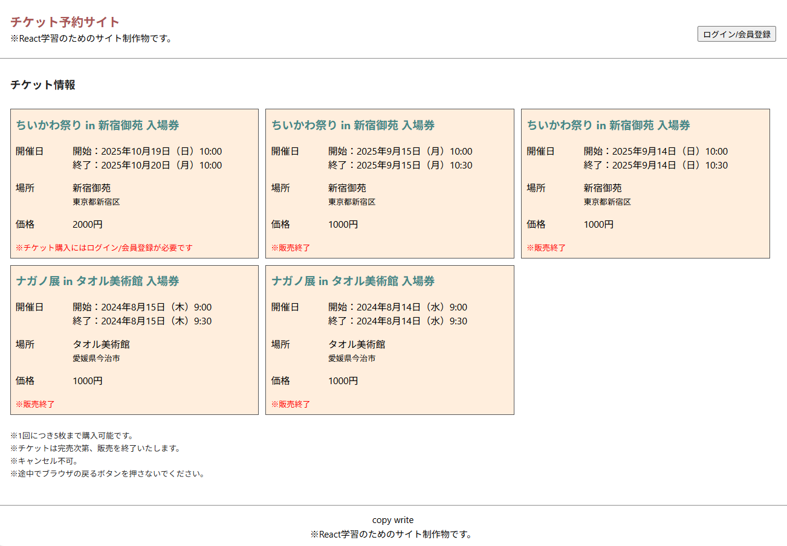
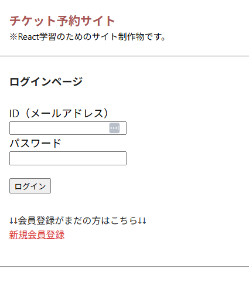
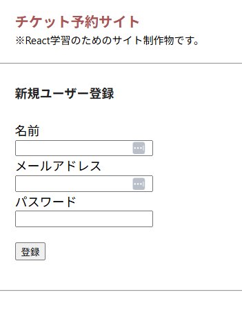
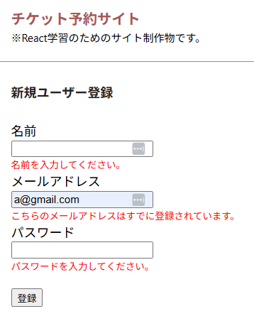
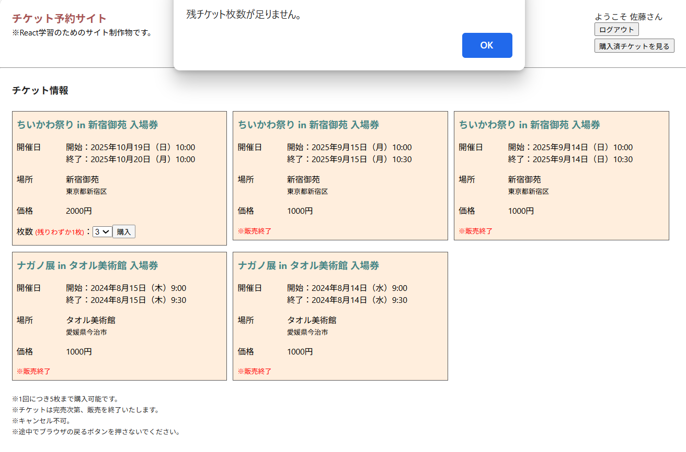
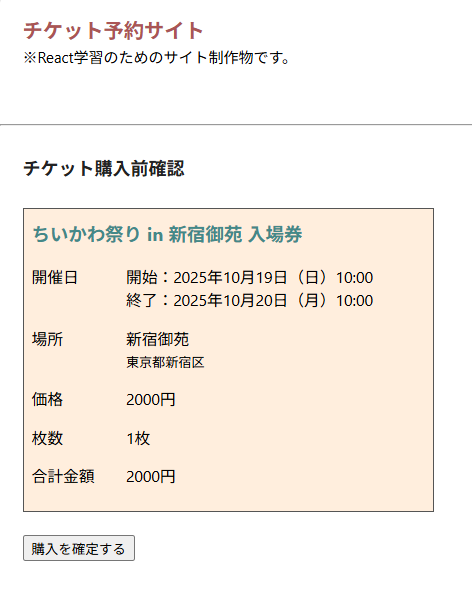
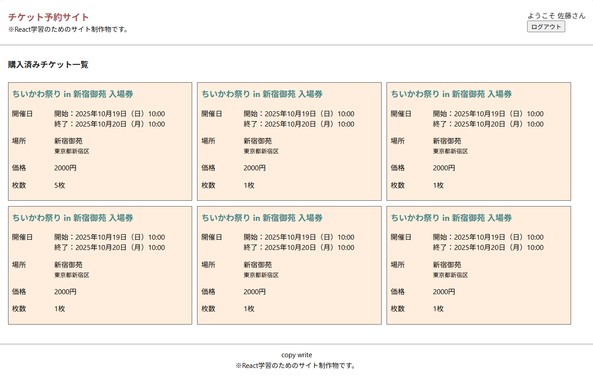

## 概要

Reactを用いたイベントチケットの予約サイトです
  - 参考サイト：https://t.livepocket.jp/e/wyxxw


## 環境

| 言語・フレームワーク  | バージョン |
| --------------------- | ---------- |
| React                 | 18.3.1     |
| React Router Dom                 | 6.25.1     |
| Express                 | 4.18.2        |
| axios                 | 1.7.3        |
| npm             |  9.6.7      |


## 機能一覧

- ユーザー登録、ログイン機能
- チケット購入機能
  - ログイン時のみ枚数選択・購入可能
- チケットの残り枚数表示
- マイページ表示機能
  - 購入済チケット一覧表示


## スクリーンショット

- トップ画面


|-------------------------------|

- ログイン画面


|-------------------------------|

- ユーザ登録画面


|-------------------------------|

- バリデーション


|-------------------------------|

- チケット購入画面（残数オーバー）


|-------------------------------|

- 購入確認画面


|-------------------------------|

- 購入チケット一覧


|-------------------------------|


## ディレクトリ構成
```
.
├── .gitignore
├── README.md
├── client
|   ├── .gitignore
|   ├── package-lock.json
|   ├── package.json
|   ├── public
|   |   └── index.html
|   └── src
|       ├── App.js
|       ├── Router.js
|       ├── api
|       ├── components
|       ├── hooks
|       ├── index.css
|       ├── index.js
|       └── pages
└── server
    ├── .gitignore
    ├── index.js
    ├── package-lock.json
    └── package.json
```


## 開発環境構築

### 起動
```
# サーバー側
cd server/
npm run start

# クライアント側
cd client/
npm run start
```


## データベース設計

### usersテーブル
| Column             | Type       | Options                        |
| ------------------ | ---------- | ------------------------------ |
| userID             | integer    | null: false, unique: true      |
| userName           | string     | null: false                    |
| email              | string     | null: false                    |
| password           | string     | null: false                    |

### ticketsテーブル
| Column             | Type       | Options                        |
| ------------------ | ---------- | ------------------------------ |
| ticketID           | integer    | null: false, unique: true      |
| ticketName         | string     | null: false                    |
| startTime          | datetime   | null: false                    |
| endTime            | datetime   | null: false                    |
| cost               | integer    | null: false                    |
| placeId            | integer    | null: false                    |
| numberOf           | integer    | null: false                    |
| purchased          | integer    | null: false, default: 0        |

### purchasesテーブル
| Column             | Type       | Options                        |
| ------------------ | ---------- | ------------------------------ |
| purchaseID         | integer    | null: false, unique: true      |
| userID             | integer    | null: false                    |
| ticketID           | integer    | null: false                    |
| numberOf           | integer    | null: false                    |

### placesテーブル
| Column             | Type       | Options                        |
| ------------------ | ---------- | ------------------------------ |
| placeID            | integer    | null: false, unique: true      |
| placeName          | string     | null: false                    |
| address            | string     | null: false                    |
